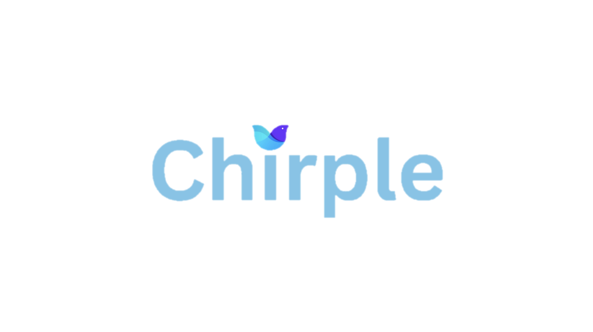
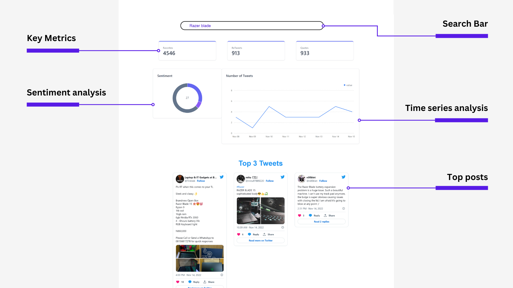

# Chirple

## Product Description
Chirple is a Twitter analytics application that would help startups and Small Medium Enterprises(SME) to analyse sentiments of their product via Twitter. Chirple makes use of Hashscrapper Twitter API to scrape the tweets on twitter.

## Overview of our product

In this current version, we offer the following features.

1. Search Bar
2. Key Metrics
3. Sentiment analysis
4. Time series analysis
5. Top Posts for that keyword

### _Search Bar_
This search bar is mainly for the user to type in the keyword that they want to assess. 

### _Key Metrics_
Through this, user can gauge the reach of that specific keyword. We calculate the total favourites, retweets and quotes.

Higher favourites, retweets and quotes naturally means higher reach. So this will be a good gauge of that keyword's current reach

### _Sentiment Analysis_
Through this, users are able to get a general sense of the sentiment of that keyword. We will tell you the number of posts that have a positive, negative or neutral sentiment.

### _Time Series Analysis_
With this, users can get a rough sensing of when their product has been talked about the most.

### _Top Posts_
With this, users can see which are the top posts based on the total favourites.

## How to use our Product
Chirple can be accessed [here](chirple.netlify.app). Do check it out!

Once you click that link, you will be directed to our homepage. To test it out, type your keyword into the search bar and click `enter`.

Please wait for some time for the metrics to be loaded.

Once it is finished, you will be able to see the metrics!

## Limitations
As of now, given that our application is in the early stages, it is not able to scrape all the posts for their specific keyword. For convenience, we have limited it to 100

## Motivation behind this
All of us use social media everyday. We post our candid thoughts and feelings of certain products. Therefore, this applciation comes in handy as it is able to get the general sentiments of a specific keyword which can be in the form of a product or event.

## Future developments
1. Increase the number of tweets to scarpe
2. Add more metrics to the dashboard
3. Try to speed up the generation of metrics.
